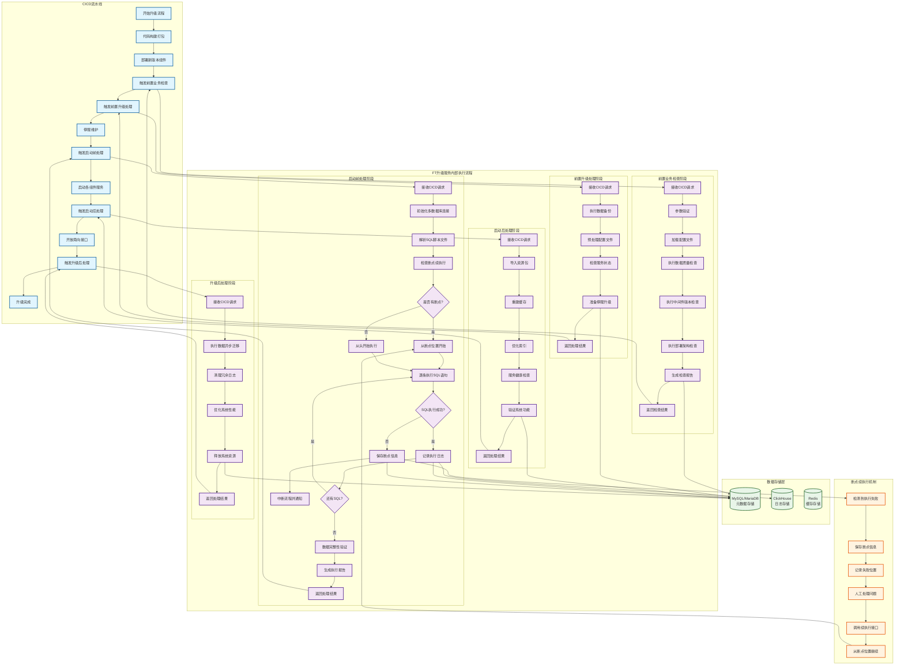

# FT团队升级需求设计

## 整体思路

新建升级专用服务**ft-auto-upgrade**，并实现CICD定义的多种升级切点；与现有业务服务（ft-manager、ft-report、ft-openapi）完全分离。这种设计确保了升级流程的独立性和稳定性，避免对现有业务系统造成影响。

### CICD与FT升级服务交互流程图



### 配置文件管理
**ft-auto-upgrade**服务将维护一系列json格式的配置文件，实现版本化的升级流程管理：

- **版本映射**：每个基线版本或者补丁版本（如3.17.5、3.17.6-P1）都对应一个独立的配置文件
- **切点定义**：配置文件详细描述每个版本升级前、中、后需要执行的所有切点
- **类路径配置**：明确指定每个切点的执行入口类名和方法名
- **适用范围**：区分通用切点和局点特有切点，支持灵活的局点定制

#### 版本类型定义

- **基线版本**：如3.17.5，包含重大功能变更，在配置文件中版本号记为**317500**
- **补丁版本**：如3.17.5-P1，主要包含bug修复或小功能优化，在配置文件中版本号记为**317501**，每个基线版本可以衍生出99个补丁版本

#### 基线版本配置文件示例

```json
{
  "version": "317500",
  "version_type": "baseline",
  "description": "FTCloud-V3.17.5基线版本升级配置",
  "metadata": {
    "created_by": "ft-team",
    "created_time": "2024-01-01T00:00:00Z",
    "last_modified": "2024-01-01T00:00:00Z",
    "checksum": "md5hash_value",
    "is_major_upgrade": true
  },
  "dependencies": {
    "min_source_version": "3.17.0",
    "max_source_version": "3.17.4",
    "required_components": ["ft-manager", "ft-report", "ft-openapi"]
  },
  "upgrade_steps": {
    "pre_business_check": [
      {
        "id": "pre_business_check_001",
        "name": "前置业务检查",
        "class_name": "com.ft.upgrade.steps.PreBusinessCheckStep",
        "is_common": true,
        "description": "升级前业务数据检查",
        "timeout": 120,
        "retry_count": 3,
        "estimated_duration": 120
      }
    ],
    "pre_upgrade_process": [
      {
        "id": "pre_upgrade_process_001",
        "name": "前置升级处理",
        "class_name": "com.ft.upgrade.steps.PreUpgradeProcessStep",
        "is_common": true,
        "description": "非停服升级准备操作",
        "timeout": 600,
        "retry_count": 3,
        "estimated_duration": 600
      }
    ],
    "startup_pre_process": [
      {
        "id": "startup_pre_process_001",
        "name": "启动前处理",
        "class_name": "com.ft.upgrade.steps.StartupPreProcessStep",
        "is_common": true,
        "description": "停服后的主要升级操作",
        "timeout": 1800,
        "retry_count": 1,
        "estimated_duration": 1800
      }
    ],
    "startup_post_process": [
      {
        "id": "startup_post_process_001",
        "name": "启动后处理",
        "class_name": "com.ft.upgrade.steps.StartupPostProcessStep",
        "is_common": true,
        "description": "系统启动后的初始化操作",
        "timeout": 900,
        "retry_count": 3,
        "estimated_duration": 900
      }
    ],
    "post_upgrade": [
      {
        "id": "post_upgrade_process_001",
        "name": "升级后处理",
        "class_name": "com.ft.upgrade.steps.PostUpgradeProcessStep",
        "is_common": true,
        "description": "升级后的持续处理操作",
        "timeout": 86400,
        "retry_count": 3,
        "estimated_duration": 86400
      },
      {
        "id": "overseas_specific_process_001",
        "name": "海外局点特有处理",
        "class_name": "com.ft.upgrade.steps.OverseasSpecificProcessStep",
        "is_common": false,
        "site_ids": ["US", "EU", "JP"],
        "description": "海外特定局点的特殊处理逻辑",
        "timeout": 300,
        "retry_count": 3,
        "estimated_duration": 300
      }
    ]
  }
}
```

#### 补丁版本配置文件示例

```json
{
  "version": "317501",
  "version_type": "patch",
  "base_version": "317500",
  "description": "FTCloud-V3.17.5-P1补丁版本升级配置",
  "metadata": {
    "created_by": "ft-team",
    "created_time": "2024-01-15T00:00:00Z",
    "last_modified": "2024-01-15T00:00:00Z",
    "checksum": "patch_md5hash_value",
    "is_major_upgrade": false,
    "patch_type": "bugfix"
  },
  "patch_info": {
    "fixed_issues": ["BUG-12345", "BUG-12346"],
    "affected_modules": ["ft-manager", "ft-report"],
  },
  "dependencies": {
    "required_base_version": "317500",
    "required_components": ["ft-manager", "ft-report"]
  },
  "upgrade_steps": {
    "startup_pre_process": [
      {
        "id": "patch_sql_execution_001",
        "name": "补丁SQL执行",
        "class_name": "com.ft.upgrade.patch.PatchSqlExecutorStep",
        "is_common": true,
        "description": "执行补丁版本的SQL脚本",
        "timeout": 300,
        "retry_count": 1,
        "estimated_duration": 180,
        "sql_scripts": [
          "patch/317501/001_fix_order_status.sql",
          "patch/317501/002_update_user_permissions.sql"
        ]
      },
      {
        "id": "patch_config_update_001",
        "name": "补丁配置更新",
        "class_name": "com.ft.upgrade.patch.PatchConfigUpdaterStep",
        "is_common": true,
        "description": "更新补丁相关的配置文件",
        "timeout": 60,
        "retry_count": 3,
        "estimated_duration": 30,
        "config_files": [
          "application-patch.properties",
          "logback-patch.xml"
        ],
        "required": false
      }
    ]
  }
}
```

### CICD集成调用流程
服务提供标准化的CICD调用接口，实现自动化升级：
- **参数输入**：CICD系统传入升级前版本号、升级后版本号、切点类型、局点ID等核心参数
- **切点收集**：服务根据版本范围自动识别和收集需要执行的配置文件，解析后汇总成一次升级过程中需要执行的切点集合
- **顺序执行**：按照配置文件中定义的优先级和依赖关系，有序执行各个切点
- **状态跟踪**：实时记录每个切点的执行状态、耗时和结果信息

### 可靠性保障机制
服务内置多重可靠性保障，确保升级过程的稳定性：
- **详细日志**：记录升级过程中的每一步操作，包括参数、执行时间、结果状态等
- **断点续执行**：当升级过程因异常中断时，支持从中断点继续执行，避免重复操作
- **异常处理**：提供完善的异常捕获和处理机制，确保升级失败时能够及时回滚
- **监控告警**：集成监控系统，实时监控升级进度和系统状态


### 关键切点

FT团队需实现以下5个核心CICD切点：
- 前置业务检查：确保升级前业务数据符合目标版本要求
- 前置升级处理：执行不需要停服的升级准备操作
- 启动前处理：执行最主要的升级处理操作（SQL执行、数据迁移、升级接口调用等）
- 启动后处理：完成系统启动后的初始化工作
- 升级后处理：处理升级后需要持续处理的数据

## 章节一：需求设计

### 0. ft-auto-upgrade服务

| 原因和动机 | 为实现升级流程的标准化、自动化和可移交化，解决人工升级效率低、出错率高、人力不足等问题。 |
| ---------- | ------------------------------------------------------------ |
| 功能描述   | 新建升级专用服务ft-auto-upgrade，与现有业务服务（ft-manager、ft-report、ft-openapi）分离，负责管理和执行升级流程。<br/>服务维护JSON格式的配置文件，每个基线版本对应一个配置文件，描述版本号、升级前中后需要执行的切点、切点执行入口类名、通用/局点特有切点等信息。 |
| 优先级     | 高                                                           |
| 前置条件   | 1. CICD环境就绪；<br/>2. 服务部署环境已准备；<br/>3. 配置文件模板已定义。 |
| 功能输入   | 1. 升级前版本号；<br>2. 升级后版本号；<br/>3. 局点信息(局点ID)；<br/>4. 环境变量；<br/>5. 切点信息。 |
| 功能输出   | 1. 升级执行状态（进行中/成功/失败）；<br/>2. 执行日志（详细记录每一步操作和结果）；<br/>3. 断点信息（用于中断后续执行）；<br/>4. 升级报告（包含升级耗时、成功/失败切点等统计信息）。 |
| 正常流程   | 1. 接收CICD调用请求，获取升级前版本号、升级后版本号和局点ID；<br/>2. 加载对应版本的配置文件；<br/>3. 解析配置文件，确定需要执行的切点序列；<br/>4. 根据局点ID筛选局点特有切点；<br/>5. 按顺序执行切点；<br/>6. 记录执行日志；<br/>7. 生成升级报告。 |
| 异常流程   | 1. 切点执行失败：a) 记录错误信息；b) 中断升级流程；c) 保存断点信息；d) 通知管理员。<br/>2. 配置文件不存在：a) 记录错误日志；b) 终止升级；c) 通知管理员。<br/>3. 服务不可用：a) CICD重试机制；b) 人工干预。 |
| 性能指标   | 服务启动时间 ≤ 30秒；配置文件加载时间 ≤ 5秒；请求响应时间 ≤ 1秒。 |
| 约束条件   | 1. 配置文件需版本化管理；<br/>2. 执行过程需记录详细日志；<br/>3. 断点信息需持久化存储； |
| 补充说明   | 1. 服务需提供REST API接口供CICD调用；<br/>2. 配置文件支持热更新； |

### 1. 前置业务检查

| 原因和动机 | 在版本升级前，需确保FT业务数据和系统环境符合目标版本的要求，避免因环境不兼容、架构缺陷或脏数据导致升级失败或数据异常。 |
| ---------- | ------------------------------------------------------------ |
| 功能描述   | 1. 版本适用性检查：a) 支持配置版本范围（如 3.17.5~3.17.9），仅当升级源版本或目标版本在范围内时执行检查。<br/>2. 中间件版本检查：a) 检查MySQL、Redis、ZooKeeper等中间件版本是否满足目标版本要求；<br/>3. 部署架构检查：a) 例如验证ZooKeeper是否有独立磁盘挂载；b) 例如检查kafka分区数、副本数是否正确配置；<br/>4. 数据质量检查：a) 主键冲突检测；b) 无主键表识别；c) 非法字符检测；d) 违反唯一约束检查；e) 数据兼容性（如字段类型、枚举值变更）。 |
| 优先级     | 中（影响升级，但非所有版本均需检查）。                       |
| 前置条件   | 1. 数据库连接信息已配置；<br/>2. 目标版本的系统要求已定义；<br/>3. 有权限访问中间件管理接口。 |
| 功能输入   | 1. 升级前版本号；<br/>2. 升级后版本号；<br/>3. 局点信息(局点ID)；<br/>4. 环境变量；<br/>5. 切点信息。 |
| 功能输出   | 1. 检查结果：a) 通过：所有检查项均符合要求；b) 警告：部分检查项超出阈值，但可继续升级（如记录日志）；c) 失败：关键检查项不通过（如主键冲突、中间件版本过低），终止升级。<br>2. 报告示例：[FT前置业务检查报告]<br>  1. 检查项: 中间件版本检查<br>    - 结果: 失败（MySQL版本5.6.35不满足最低要求5.7.0）<br>    - 建议: 升级MySQL至5.7.0或更高版本<br>  2. 检查项: ZooKeeper磁盘挂载检查<br>    - 结果: 警告（ZooKeeper数据目录与系统目录共用磁盘）<br>    - 建议: 为ZooKeeper配置独立的数据磁盘<br>  3. 检查项: 主键冲突检测<br>    - 结果: 失败（发现15条冲突记录，阈值0）<br>    - 建议: 执行 `SELECT * FROM orders WHERE id IN (SELECT id FROM orders GROUP BY id HAVING COUNT(*) > 1);` 查看冲突记录<br>  4. 检查项: 无主键表检测<br>    - 结果: 警告（发现3张无主键表）<br>    - 建议: 为表 user_logs, temp_data, audit_records 添加主键 |
| 正常流程   | 1. 解析版本范围：a) 若当前版本或目标版本在 min_version~max_version 范围内，执行检查。<br>2. 读取匹配的检测规则：业务数据检查规则配置、中间件版本要求配置、部署架构要求配置。<br/>2. 执行中间件版本检查：a) 连接各中间件服务；b) 获取版本信息；c) 与要求版本比对。<br/>3. 执行部署架构检查：<br/>4. 执行数据质量检查：a) 运行配置的SQL语句，统计异常记录数；b) 检测主键冲突和无主键表；c) 扫描非法字符和违反约束的记录。<br/>5. 比对阈值：a) 若异常数 ≤ threshold，标记为通过。<br/>6. 生成报告：输出通过/警告/失败结果。 |
| 异常流程   | 1. 版本不匹配：跳过检查并记录日志。<br/>2. 中间件连接失败：a) 重试3次；b) 若仍失败，记录错误并终止升级。<br/>3. SQL执行失败：终止检查并报错（如语法错误或表不存在）。<br/>4. 数据库连接超时：重试3次后终止升级。 |
| 性能指标   | 1. 中间件版本检查耗时 ≤ 30秒；<br/>2. 部署架构检查耗时 ≤ 1分钟；<br/>3. 数据质量检查耗时 ≤ 2分钟（数据量百万级）。 |
| 约束条件   | 1. 仅支持SQL兼容的数据库（MySQL、ClickHouse等）；<br/>2. 需提前定义检查规则，不支持动态生成SQL；<br/>3. 中间件版本检查需要相应的访问权限；<br/>4. 部署架构检查需要操作系统级别的访问权限； |
| 补充说明   | 1. 中间件版本要求应根据兼容性测试结果定义；<br/>2. 部署架构检查可通过SSH或Agent方式实现；<br/>3. 脏数据需手动执行修复脚本；<br/>4. 检查规则需共同评审确认。 |

### 2. 前置升级处理

| 原因和动机 | 减少停服时间，提高升级效率 |
| ---------- | ------------------------------------------------------------ |
| 功能描述   | 执行不需要停服的FT业务系统升级准备操作，如非阻塞性数据备份、配置文件预处理、服务状态检查等。 |
| 优先级     | 高 |
| 前置条件   | 1. 前置业务检查通过；<br/>2. 备份存储位置可用；<br/>3. 配置文件模板已准备。 |
| 功能输入   | 1. 升级前版本号；<br/>2. 升级后版本号；<br/>3. 局点信息(局点ID)；<br/>4. 环境变量；<br/>5. 切点信息。 |
| 功能输出   | 1. 备份完成状态（成功/失败、备份文件路径）；<br>2. 预处理结果（成功/失败、修改的配置文件列表）；<br>3. 服务状态检查报告（正常/异常服务列表）；<br>4. 操作日志。 |
| 正常流程   | 1. 执行非阻塞性数据备份：<br>   a) 备份核心业务数据（如订单表、用户表）；<br>   b) 备份配置文件。<br>2. 预处理配置文件：<br>   a) 根据规则替换配置文件中的占位符；<br>   b) 验证配置文件格式。<br>3. 检查服务状态：<br>   a) 检查关键服务是否正常运行；<br>   b) 记录服务版本信息。<br>4. 准备停服升级：<br>   a) 生成停服前准备报告；<br>   b) 通知相关人员。 |
| 异常流程   | 1. 备份失败：<br>   a) 记录错误日志；<br>   b) 尝试重新备份（最多3次）；<br>   c) 若仍失败，终止升级。<br>2. 预处理失败：<br>   a) 记录错误日志；<br>   b) 恢复配置文件；<br>   c) 终止升级。<br>3. 服务状态异常：<br>   a) 记录异常服务；<br>   b) 尝试重启服务；<br>   c) 若重启失败，终止升级。 |
| 性能指标   | 前置处理耗时 ≤ 10分钟。 |
| 约束条件   | 1. 备份数据需完整可恢复；<br/>2. 预处理操作不能影响当前运行的服务；<br/>3. 停服前准备工作需在非峰值时段完成。 |
| 补充说明   | 1. 备份数据需定期清理，保留最近3次升级的备份；<br/>2. 配置文件变更需记录版本历史。 |

### 3. 启动前处理

| 原因和动机 | 确保FT业务系统新版本启动前的数据和配置准备就绪，避免启动失败。 |
| ---------- | ------------------------------------------------------------ |
| 功能描述   | 执行FT业务系统最主要的升级处理操作，包括：<br/>1. **多数据库SQL执行**：支持同时连接FT数据库和中台数据库，执行不兼容SQL脚本；<br/>2. **逐条SQL执行与日志记录**：一个SQL文件包含多条SQL语句时，逐条执行并记录每条SQL的执行状态、耗时、影响行数等详细信息；<br/>3. **断点续执行机制**：当某条SQL执行失败时，手动处理问题后可从失败的SQL语句开始继续执行，避免重复执行已成功的SQL；<br/>4. **数据结构变更**：创建新表、迁移数据、重命名表等操作；<br/>5. **业务数据迁移**：按照迁移规则转换数据；<br/>6. **配置文件更新**：替换新版本配置文件。 |
| 优先级     | 高 |
| 前置条件   | 1. 组件新版本已替换完成；<br/>2. 系统处于停服状态；<br/>3. 前置升级处理完成；<br/>4. FT数据库和中台数据库连接配置已就绪。 |
| 功能输入   | 1. 升级前版本号；<br/>2. 升级后版本号；<br/>3. 局点信息(局点ID)；<br/>4. 环境变量；<br/>5. 切点信息；<br/>6. 多数据库连接配置（FT数据库、中台数据库等）；<br/>7. SQL脚本文件路径和执行顺序；<br/>8. 断点续执行标识（可选，用于从指定SQL开始执行）。 |
| 功能输出   | 1. 升级处理结果（成功/失败）；<br/>2. **详细SQL执行报告**：<br/>   - 每条SQL的执行状态（成功/失败/跳过）<br/>   - 每条SQL的执行耗时<br/>   - 每条SQL的影响行数<br/>   - 失败SQL的错误信息和错误代码<br/>   - 执行进度（已执行/总数）<br/>3. 数据迁移报告（迁移记录数、失败记录数、耗时）；<br/>4. **断点信息**：记录当前执行到的SQL文件名、行号、SQL语句内容，用于续执行；<br/>5. 操作日志（详细记录每一步操作）。 |
| 正常流程   | 1. **初始化多数据库连接**：<br/>   a) 根据配置建立FT数据库连接；<br/>   b) 根据配置建立中台数据库连接；<br/>   c) 验证所有数据库连接的可用性。<br/>2. **解析SQL脚本文件**：<br/>   a) 按配置顺序读取SQL脚本文件；<br/>   b) 解析每个文件中的SQL语句（以分号分隔）；<br/>   c) 识别每条SQL的目标数据库（通过注释或配置标识）；<br/>   d) 生成SQL执行计划。<br/>3. **检查断点续执行**：<br/>   a) 如果存在断点信息，定位到上次失败的SQL位置；<br/>   b) 跳过已成功执行的SQL语句；<br/>   c) 从断点位置开始执行。<br/>4. **逐条执行SQL语句**：<br/>   a) 选择对应的数据库连接；<br/>   b) 记录SQL执行开始时间和语句内容；<br/>   c) 执行SQL语句；<br/>   d) 记录执行结果（成功/失败、耗时、影响行数）；<br/>   e) 如果执行失败，保存断点信息并中断流程；<br/>   f) 如果执行成功，继续下一条SQL。<br/>5. **数据完整性验证**：<br/>   a) 执行一致性检查SQL；<br/>   b) 比对关键指标（如记录数、总和）；<br/>   c) 验证跨数据库数据一致性。<br/>6. **生成执行报告**：<br/>   a) 汇总所有SQL执行结果；<br/>   b) 统计总耗时、成功数、失败数；<br/>   c) 生成详细的执行日志。 |
| 异常流程   | 1. **数据库连接失败**：<br/>   a) 记录连接失败的数据库信息；<br/>   b) 重试连接（最多3次）；<br/>   c) 若仍失败，终止升级并通知管理员。<br/>2. **SQL执行失败**：<br/>   a) 记录失败的SQL语句、错误信息、错误代码；<br/>   b) 保存断点信息（文件名、行号、SQL内容）；<br/>   c) 中断升级流程；<br/>   d) 通知管理员进行人工处理；<br/>   e) 人工处理完成后，可调用断点续执行接口继续。<br/>3. **SQL解析失败**：<br/>   a) 记录解析失败的文件名和位置；<br/>   b) 终止升级并通知管理员检查SQL文件格式。<br/>4. **数据迁移失败**：<br/>   a) 记录失败记录的详细信息；<br/>   b) 保存断点信息；<br/>   c) 执行回滚操作（如果支持）。<br/>5. **跨数据库事务失败**：<br/>   a) 回滚所有相关数据库的事务；<br/>   b) 记录事务失败的详细信息；<br/>   c) 恢复到执行前状态。 |
| 性能指标   | 1. 启动前处理需在30分钟内完成（数据量百万级）；<br/>2. 单条SQL执行超时时间 ≤ 5分钟；<br/>3. SQL执行日志记录延迟 ≤ 1秒；<br/>4. 断点信息保存时间 ≤ 3秒。 |
| 约束条件   | 1. 所有SQL脚本需提前在测试环境验证通过；<br/>2. 数据迁移需保证数据一致性；<br/>3. 升级过程中需记录详细日志，便于问题排查；<br/>4. **SQL文件格式要求**：<br/>   - 每条SQL语句以分号结尾<br/>   - 支持多行SQL语句<br/>   - 通过注释标识目标数据库（如：-- @database: ft_db）<br/>   - 文件编码必须为UTF-8<br/>5. **多数据库连接管理**：<br/>   - 每个数据库连接需配置独立的连接池<br/>   - 支持事务管理和回滚<br/>   - 连接超时和重试机制<br/>6. **断点续执行限制**：<br/>   - 断点信息保留7天<br/>   - 同一升级任务最多支持10次断点续执行<br/>   - 续执行前需验证数据库状态一致性。 |
| 补充说明   | 1. **SQL执行日志格式示例**：<br/>[2024-01-01 10:00:01] 文件: upgrade_v3.17.5.sql, 行号: 15<br/>SQL: ALTER TABLE orders ADD COLUMN status_new VARCHAR(20);<br/>数据库: ft_db<br/>执行状态: 成功<br/>耗时: 1.2秒<br/>影响行数: 0<br/>2. **断点信息格式示例**：<br/>断点ID: BP_20240101_100001<br/>执行ID: EXEC_20240101_100000<br/>失败位置: upgrade_v3.17.5.sql:25<br/>失败SQL: INSERT INTO user_permissions SELECT * FROM temp_permissions;<br/>错误信息: Duplicate entry '1001' for key 'PRIMARY'<br/>保存时间: 2024-01-01 10:00:15<br/>4. 升级脚本需按顺序执行，并有明确的依赖关系；<br/>5. 大数据量迁移可考虑分批处理；<br/>6. 升级前需备份关键数据；<br/>7. 支持SQL执行的并行度配置，但需确保数据一致性。 |

### 4. 启动后处理

| 原因和动机 | 完成FT业务系统启动后的初始化工作 |
| ---------- | ------------------------------------------------------------ |
| 功能描述   | 执行FT业务系统有组件依赖的升级处理，如导入资源包、缓存重建、索引优化、服务健康检查等。 |
| 优先级     | 高 |
| 前置条件   | 1. 全环境各组件已启动；<br>2. 启动前处理完成且成功；<br>3. 服务健康检查通过。 |
| 功能输入   | 1. 资源包（如图片、模板、静态数据）；<br>2. 缓存配置（如过期时间、刷新策略）；<br>3. 索引规则（如索引名称、字段）；<br>4. 健康检查配置（如检查URL、超时时间）。 |
| 功能输出   | 1. 初始化完成状态（成功/失败）；<br>2. 资源导入报告（导入文件数、失败数）；<br>3. 缓存重建状态（完成百分比、耗时）；<br>4. 索引优化结果（优化的索引数、性能提升百分比）；<br>5. 健康检查报告（通过/失败的服务列表）。 |
| 正常流程   | 1. 导入资源包：<br>   a) 解压资源包；<br>   b) 导入资源到指定位置；<br>   c) 验证资源完整性。<br>2. 重建缓存：<br>   a) 清除旧缓存；<br>   b) 加载基础数据到缓存；<br>   c) 验证缓存数据。<br>3. 优化索引：<br>   a) 分析表结构；<br>   b) 重建或优化索引；<br>   c) 收集索引统计信息。<br>4. 服务健康检查：<br>   a) 检查服务API是否可用；<br>   b) 检查数据库连接；<br>   c) 检查第三方服务依赖。<br>5. 验证系统功能：<br>   a) 执行冒烟测试；<br>   b) 验证核心业务流程。 |
| 异常流程   | 1. 资源导入失败：<br>   a) 记录错误日志；<br>   b) 尝试重新导入（最多3次）；<br>   c) 若仍失败，通知管理员。<br>2. 缓存重建失败：<br>   a) 清除无效缓存；<br>   b) 记录错误；<br>   c) 手动触发重建。<br>3. 索引优化失败：<br>   a) 回滚索引操作；<br>   b) 记录错误；<br>   c) 通知管理员。<br>4. 健康检查失败：<br>   a) 记录失败服务；<br>   b) 尝试重启服务；<br>   c) 若重启失败，通知管理员。 |
| 性能指标   | 1. 启动后处理需在15分钟内完成；<br/>2. 缓存重建速度 ≥ 1000条/秒；<br/>3. 索引优化耗时 ≤ 5分钟。 |
| 约束条件   | 1. 资源包需经过安全扫描，无恶意代码；<br/>2. 缓存重建过程中需避免服务不可用；<br/>3. 索引优化需在低峰期执行。 |
| 补充说明   | 1. 资源包版本需与系统版本匹配；<br>2. 缓存重建可考虑分批次进行，减少对服务的影响；<br>3. 索引优化前后需收集性能数据，评估优化效果。 |

### 5. 升级后处理

| 原因和动机 | 清理本次升级产生的缓存文件、备份文件 |
| ---------- | ------------------------------------------------------------ |
| 功能描述   | 处理FT业务系统需要持续处理的数据，如数据异步迁移、日志清理、性能优化、资源释放等。 |
| 优先级     | 中 |
| 前置条件   | 1. 停服升级完成；<br>2. 系统已开放南向接口；<br>3. 系统运行稳定。 |
| 功能输入   | 1. 迁移任务配置（如源表、目标表、迁移条件）；<br>2. 清理规则（如日志保留天数、文件大小阈值）；<br>3. 优化策略（如SQL调优规则、JVM参数）；<br>4. 资源释放配置（如临时文件路径、缓存过期时间）。 |
| 功能输出   | 1. 迁移进度报告（已迁移记录数、剩余记录数、耗时）；<br>2. 清理结果（清理的文件数、释放空间）；<br>3. 优化效果分析（性能提升百分比、资源占用降低百分比）；<br>4. 资源释放报告（释放的内存、磁盘空间）。 |
| 正常流程   | 1. 执行数据异步迁移：<br>   a) 配置迁移任务；<br>   b) 启动异步迁移进程；<br>   c) 监控迁移进度；<br>   d) 迁移完成后验证数据一致性。<br>2. 清理冗余日志：<br>   a) 清理过期日志文件；<br>   b) 压缩归档重要日志；<br>   c) 验证日志清理结果。<br>3. 优化系统性能：<br>   a) 分析系统运行数据；<br>   b) 调整SQL语句或索引；<br>   c) 调整JVM参数；<br>   d) 验证优化效果。<br>4. 释放系统资源：<br>   a) 删除临时文件；<br>   b) 清理无用缓存；<br>   c) 释放数据库连接池；<br>   d) 监控资源使用情况。 |
| 异常流程   | 1. 迁移失败：<br>   a) 记录失败原因；<br>   b) 重试迁移（最多3次）；<br>   c) 若仍失败，通知管理员。<br>2. 清理失败：<br>   a) 记录错误日志；<br>   b) 跳过该文件继续清理；<br>   c) 通知管理员手动处理。<br>3. 优化效果不佳：<br>   a) 回滚优化参数；<br>   b) 重新分析系统；<br>   c) 制定新的优化策略。 |
| 性能指标   | 1. 所有升级后处理任务需在24小时内完成；<br/>2. 数据异步迁移速率 ≥ 5000条/秒；<br/>3. 日志清理耗时 ≤ 1小时。 |
| 约束条件   | 1. 数据异步迁移不能影响系统正常运行；<br/>2. 日志清理需保留至少7天的核心业务日志；<br/>3. 性能优化需经过测试环境验证。 |
| 补充说明   | 1. 数据异步迁移可根据系统负载动态调整速率；<br>2. 日志清理策略需符合公司数据保留政策；<br>3. 升级后需持续监控系统性能，及时发现并解决问题。 |

## 章节二：功能设计

### 1. 功能概述

ft-auto-upgrade服务是一个专门用于FT团队业务系统升级的自动化工具，通过配置文件驱动的方式，实现升级流程的标准化、自动化和可移交化。服务接收CICD传入的版本号和局点ID，自动执行相应的升级切点，并支持断点续执行功能。

### 2. 系统架构设计

#### 2.1 整体架构
```
┌─────────────────────────────────────────────────────────────┐
│                    CICD调用层                                │
├─────────────────────────────────────────────────────────────┤
│                ft-auto-upgrade服务                          │
│  ┌─────────────┐  ┌─────────────┐  ┌─────────────┐         │
│  │  对外接口层   │  │  配置管理层   │  │  执行引擎层   │         │
│  └─────────────┘  └─────────────┘  └─────────────┘         │
│  ┌─────────────┐  ┌─────────────┐  ┌─────────────┐         │
│  │  日志管理层   │  │  状态管理层   │  │  断点管理层   │         │
│  └─────────────┘  └─────────────┘  └─────────────┘         │
├─────────────────────────────────────────────────────────────┤
│                    数据持久层                                │
│  ┌─────────────┐  ┌─────────────┐  ┌─────────────┐         │
│  │MySQL/Mariadb│  │ Clickhouse  │  │    Redis    │         │
│  │  (元数据)    │  │  (详细日志)   │  │   (缓存)     │         │
│  └─────────────┘  └─────────────┘  └─────────────┘         │
└─────────────────────────────────────────────────────────────┘
```

#### 2.2 技术栈选择
- 参考ft-manager的pom文件

#### 2.3 服务部署架构

- 单实例运行

### 3. 核心功能模块设计

#### 3.1 配置管理模块
**功能职责**：

- 配置文件版本控制与管理
- 配置文件解析与验证
- 配置文件热更新
- 局点特有配置管理

**核心类设计**：
```java
@Component
public class ConfigurationManager {
    // 配置文件加载
    public UpgradeConfiguration loadConfiguration(String version);
    
    // 配置文件验证
    public ValidationResult validateConfiguration(UpgradeConfiguration config);
    
    // 热更新配置
    public void reloadConfiguration(String version);
    
    // 局点配置筛选
    public List<UpgradeStep> filterBySiteId(String siteId, List<UpgradeStep> steps);
}
```

**配置文件结构**：

```json
{
  "version": "3.17.5",
  "description": "FTCloud-V3.17.5版本升级配置",
  "metadata": {
    "created_by": "system",
    "created_time": "2024-01-01T00:00:00Z",
    "last_modified": "2024-01-01T00:00:00Z",
    "checksum": "md5hash"
  },
  "dependencies": {
    "min_source_version": "3.17.0",
    "max_source_version": "3.17.4",
    "required_components": ["ft-manager", "ft-report"]
  },
  "upgrade_steps": {
    "pre_upgrade": [...],
    "startup_pre_process": [...],
    "startup_post_process": [...],
    "post_upgrade": [...]
  }
}
```

#### 3.2 切点执行模块
**功能职责**：
- 切点类动态加载
- 切点执行引擎
- 执行顺序控制
- 异常处理与断点保存

**核心类设计**：
```java
@Service
public class UpgradeExecutor {
    // 执行升级
    public ExecutionResult executeUpgrade(UpgradeRequest request);
    
    // 断点续执行
    public ExecutionResult resumeUpgrade(String executionId);
    
    // 执行单个切点
    private StepResult executeStep(UpgradeStep step, ExecutionContext context);
    
    // 保存断点信息
    private void saveBreakpoint(String executionId, UpgradeStep currentStep);
}

@Component
public class StepClassLoader {
    // 动态加载切点类
    public Class<?> loadStepClass(String className);
    
    // 执行切点方法
    public Object executeStepMethod(Class<?> clazz, String methodName, Object... args);
}
```

**执行流程设计**：
```
开始升级
    ↓
接收CICD调用请求
    ↓
参数验证（升级前版本号、升级后版本号、切点类型、局点ID、环境信息）
    ↓
加载对应版本的配置文件
    ↓
解析配置文件，确定需要执行的切点序列
    ↓
根据局点ID筛选局点特有切点
    ↓
创建执行上下文
    ↓
根据切点类型执行对应切点
    ├─ 1. 前置业务检查（pre_business_check）
    ├─ 2. 前置升级处理（pre_upgrade_process）
    ├─ 3. 启动前处理（startup_pre_process）
    ├─ 4. 启动后处理（startup_post_process）
    └─ 5. 升级后处理（post_upgrade）
    ↓
记录执行日志
    ↓
生成升级报告
    ↓
结束（返回执行状态、日志、断点信息、升级报告）
```

#### 3.3 日志与报告模块
**功能职责**：

- 执行日志记录
- 升级报告生成
- 断点信息管理
- 统计分析与可视化

**核心类设计**：
```java
@Service
public class LoggingService {
    // 记录执行日志
    public void logExecution(String executionId, LogLevel level, String message);
    
    // 记录切点执行
    public void logStepExecution(String executionId, String stepId, StepResult result);
    
    // 生成执行报告
    public UpgradeReport generateReport(String executionId);
}

@Entity
public class ExecutionLog {
    private String id;
    private String executionId;
    private String stepId;
    private LogLevel level;
    private String message;
    private LocalDateTime timestamp;
    private Map<String, Object> metadata;
}
```

#### 3.4 API模块

**功能职责**：
- CICD调用接口
- 状态查询接口
- 断点续执行接口
- 配置管理接口

**REST API设计**：
```java
@RestController
@RequestMapping("/api/v1/upgrade")
public class UpgradeController {
    
    /**
     * 执行升级
     * 接收CICD传入的升级前版本号、升级后版本号、切点类型、局点ID、环境信息
     */
    @PostMapping("/execute")
    public ResponseEntity<ExecutionResponse> executeUpgrade(@RequestBody UpgradeRequest request);
    
    /**
     * 查询升级执行状态
     */
    @GetMapping("/status/{executionId}")
    public ResponseEntity<StatusResponse> getStatus(@PathVariable String executionId);
    
    /**
     * 断点续执行升级
     */
    @PostMapping("/resume/{executionId}")
    public ResponseEntity<ExecutionResponse> resumeUpgrade(@PathVariable String executionId);
    
    /**
     * 获取升级报告
     */
    @GetMapping("/report/{executionId}")
    public ResponseEntity<UpgradeReport> getReport(@PathVariable String executionId);
}

/**
 * 升级请求参数，与需求设计中的功能输入保持一致
 */
public class UpgradeRequest {
    private String upgradeBeforeVersion;  // 升级前版本号
    private String upgradeAfterVersion;   // 升级后版本号
    private String siteId;               // 局点ID
    private String stepType;             // 切点类型
    private String environment;          // 环境变量
    
    // getters and setters...
}
```

### 4. 数据模型设计

基于断点续执行和SQL精确定位的需求，重新设计数据模型如下：

#### 4.1 升级执行记录模型
**用途**：记录一次完整的升级过程，一次升级对应一条记录
**存储位置**：MySQL/MariaDB

```java
@Entity
@Table(name = "upgrade_execution")
public class UpgradeExecution {
    @Id
    private String executionId;              // 执行ID（UUID）
    private String sourceVersion;            // 升级前版本号
    private String targetVersion;            // 升级后版本号
    private String siteId;                   // 局点ID
    private String stepType;                 // 切点类型（pre_business_check等）
    private String environment;              // 环境信息
    private ExecutionStatus status;          // 执行状态（PENDING/RUNNING/SUCCESS/FAILED/PAUSED）
    private LocalDateTime startTime;         // 开始时间
    private LocalDateTime endTime;           // 结束时间
    private String currentStepId;            // 当前执行的步骤ID
    private Integer totalSteps;              // 总步骤数
    private Integer completedSteps;          // 已完成步骤数
    private String errorMessage;             // 错误信息
    private String createdBy;                // 创建者（CICD系统标识）
    private LocalDateTime createdTime;       // 创建时间
    private LocalDateTime updatedTime;       // 更新时间
}
```

#### 4.2 切点执行记录模型
**用途**：记录每个切点的执行详情，一次切点调用对应一条记录
**存储位置**：MySQL/MariaDB

```java
@Entity
@Table(name = "step_execution")
public class StepExecution {
    @Id
    private String id;                       // 主键ID（UUID）
    private String executionId;              // 关联的升级执行ID
    private String stepId;                   // 步骤ID（配置文件中定义）
    private String stepName;                 // 步骤名称
    private String stepType;                 // 步骤类型
    private String className;                // 执行类名
    private StepStatus status;               // 步骤状态（PENDING/RUNNING/SUCCESS/FAILED/SKIPPED）
    private LocalDateTime startTime;         // 开始时间
    private LocalDateTime endTime;           // 结束时间
    private Long duration;                   // 执行耗时（毫秒）
    private String result;                   // 执行结果（JSON格式）
    private String errorMessage;             // 错误信息
    private String metadata;                 // 元数据（JSON格式，包含执行参数等）
    private Integer retryCount;              // 重试次数
    private Integer executionOrder;          // 执行顺序
    private LocalDateTime createdTime;       // 创建时间
    private LocalDateTime updatedTime;       // 更新时间
}
```

#### 4.3 SQL执行记录模型
**用途**：记录SQL脚本中每条SQL语句的执行详情，支持精确的断点续执行
**存储位置**：MySQL/MariaDB

```java
@Entity
@Table(name = "sql_execution_record")
public class SqlExecutionRecord {
    @Id
    private String id;                       // 主键ID（UUID）
    private String executionId;              // 关联的升级执行ID
    private String stepId;                   // 关联的步骤ID
    private String sqlFileId;                // SQL文件标识（文件名+版本号的MD5）
    private String sqlFileName;              // SQL文件名
    private Integer sqlLineNumber;           // SQL语句在文件中的行号
    private Integer sqlSequence;             // SQL语句在文件中的序号（第几条SQL）
    private String sqlContent;               // SQL语句内容（完整SQL）
    private String sqlContentHash;           // SQL内容的MD5哈希值
    private String targetDatabase;           // 目标数据库标识
    private SqlStatus status;                // SQL执行状态（PENDING/RUNNING/SUCCESS/FAILED/SKIPPED）
    private LocalDateTime startTime;         // 开始执行时间
    private LocalDateTime endTime;           // 结束执行时间
    private Long duration;                   // 执行耗时（毫秒）
    private Integer affectedRows;            // 影响行数
    private String errorCode;                // 错误代码
    private String errorMessage;             // 错误信息
    private String executionResult;          // 执行结果详情
    private Integer retryCount;              // 重试次数
    private LocalDateTime createdTime;       // 创建时间
    private LocalDateTime updatedTime;       // 更新时间
}
```

#### 4.4 断点信息模型
**用途**：记录升级过程中的断点信息，支持从任意位置续执行
**存储位置**：MySQL/MariaDB

```java
@Entity
@Table(name = "upgrade_breakpoint")
public class UpgradeBreakpoint {
    @Id
    private String id;                       // 主键ID（UUID）
    private String executionId;              // 关联的升级执行ID
    private String stepId;                   // 中断时的步骤ID
    private String sqlFileId;                // 中断时的SQL文件ID（如果适用）
    private Integer sqlSequence;             // 中断时的SQL序号（如果适用）
    private String breakpointType;           // 断点类型（STEP_LEVEL/SQL_LEVEL）
    private String contextData;              // 执行上下文数据（JSON格式）
    private String failureReason;            // 中断原因
    private String resumeInstructions;       // 续执行指导说明
    private BreakpointStatus status;         // 断点状态（ACTIVE/RESOLVED/EXPIRED）
    private LocalDateTime breakpointTime;    // 断点产生时间
    private LocalDateTime expiryTime;        // 断点过期时间
    private String resolvedBy;               // 处理人员
    private LocalDateTime resolvedTime;      // 处理时间
    private String resolveNotes;             // 处理说明
    private LocalDateTime createdTime;       // 创建时间
    private LocalDateTime updatedTime;       // 更新时间
}
```

#### 4.5 升级报告模型

**用途**：生成和存储升级执行报告，提供统计分析数据
**存储位置**：MySQL/MariaDB

```java
@Entity
@Table(name = "upgrade_report")
public class UpgradeReport {
    @Id
    private String id;                       // 主键ID（UUID）
    private String executionId;              // 关联的升级执行ID
    private String reportType;               // 报告类型（SUMMARY/DETAILED/ERROR_ANALYSIS）
    private String sourceVersion;            // 升级前版本
    private String targetVersion;            // 升级后版本
    private String siteId;                   // 局点ID
    private String stepType;                 // 切点类型
    private ReportStatus status;             // 报告状态（GENERATED/ARCHIVED）
    private Integer totalSteps;              // 总步骤数
    private Integer successSteps;            // 成功步骤数
    private Integer failedSteps;             // 失败步骤数
    private Integer skippedSteps;            // 跳过步骤数
    private Integer totalSqlCount;           // 总SQL数量
    private Integer successSqlCount;         // 成功SQL数量
    private Integer failedSqlCount;          // 失败SQL数量
    private Long totalDuration;              // 总耗时（毫秒）
    private String reportContent;            // 报告内容（JSON格式）
    private String summary;                  // 执行摘要
    private String recommendations;          // 建议和改进点
    private LocalDateTime generatedTime;     // 报告生成时间
    private LocalDateTime createdTime;       // 创建时间
    private LocalDateTime updatedTime;       // 更新时间
}
```

#### 4.6 数据模型关系图

```
UpgradeExecution (1) -----> StepExecution(N) -----> StepExecutionRecord (N) -----> SqlExecutionRecord (N)
       |                           
       |                           
       v                           
UpgradeBreakpoint (1)      
       |                           
       |                           
       v                           
UpgradeReport (1)          
```

#### 4.8 索引设计

**upgrade_execution表索引**：

- PRIMARY KEY (execution_id)
- INDEX idx_version_site (source_version, target_version, site_id)
- INDEX idx_status_time (status, created_time)
- INDEX idx_step_type (step_type)

**step_execution表索引**：
- PRIMARY KEY (id)
- INDEX idx_execution_id (execution_id)
- INDEX idx_step_status (step_id, status)
- INDEX idx_execution_order (execution_id, execution_order)

**sql_execution_record表索引**：
- PRIMARY KEY (id)
- INDEX idx_execution_step (execution_id, step_id)
- INDEX idx_sql_file_seq (sql_file_id, sql_sequence)
- INDEX idx_status_time (status, created_time)
- UNIQUE INDEX uk_sql_content (execution_id, step_id, sql_content_hash)

**upgrade_breakpoint表索引**：
- PRIMARY KEY (id)
- UNIQUE INDEX uk_execution_active (execution_id, status) WHERE status = 'ACTIVE'
- INDEX idx_status_time (status, breakpoint_time)

#### 4.9 数据保留策略

数据量不大，默认无需清理

### 5. 关键技术实现

#### 5.1 配置文件热更新机制
```java
@Component
public class ConfigurationWatcher {
    
    @EventListener
    public void handleConfigurationChange(ConfigurationChangeEvent event) {
        // 验证新配置
        ValidationResult result = configurationManager.validateConfiguration(event.getNewConfig());
        if (result.isValid()) {
            // 热更新配置
            configurationManager.reloadConfiguration(event.getVersion());
            // 通知相关组件
            applicationEventPublisher.publishEvent(new ConfigurationReloadedEvent(event.getVersion()));
        }
    }
}
```

#### 5.2 断点续执行机制
```java
@Service
public class BreakpointManager {
    
    public void saveBreakpoint(String executionId, ExecutionContext context) {
        BreakpointData data = new BreakpointData();
        data.setExecutionId(executionId);
        data.setCurrentStepIndex(context.getCurrentStepIndex());
        data.setExecutionContext(JsonUtils.toJson(context));
        data.setTimestamp(LocalDateTime.now());
        
        breakpointRepository.save(data);
    }
    
    public ExecutionContext restoreBreakpoint(String executionId) {
        BreakpointData data = breakpointRepository.findByExecutionId(executionId);
        if (data != null) {
            return JsonUtils.fromJson(data.getExecutionContext(), ExecutionContext.class);
        }
        return null;
    }
}
```

### 6. 性能优化设计

#### 6.1 异步执行优化
```java
@Service
public class AsyncUpgradeExecutor {
    
    @Async("upgradeExecutorPool")
    public CompletableFuture<ExecutionResult> executeUpgradeAsync(UpgradeRequest request) {
        return CompletableFuture.supplyAsync(() -> {
            return upgradeExecutor.executeUpgrade(request);
        });
    }
    
    @Bean("upgradeExecutorPool")
    public TaskExecutor upgradeExecutorPool() {
        ThreadPoolTaskExecutor executor = new ThreadPoolTaskExecutor();
        executor.setCorePoolSize(5);
        executor.setMaxPoolSize(10);
        executor.setQueueCapacity(100);
        executor.setThreadNamePrefix("upgrade-executor-");
        executor.initialize();
        return executor;
    }
}
```

### 9. 测试策略

#### 9.1 单元测试
```java
@ExtendWith(MockitoExtension.class)
class UpgradeExecutorTest {
    
    @Mock
    private ConfigurationManager configurationManager;
    
    @Mock
    private StepClassLoader stepClassLoader;
    
    @InjectMocks
    private UpgradeExecutor upgradeExecutor;
    
    @Test
    void testExecuteUpgrade_Success() {
        // 测试升级执行成功场景
        UpgradeRequest request = createUpgradeRequest();
        UpgradeConfiguration config = createMockConfiguration();
        
        when(configurationManager.loadConfiguration(anyString())).thenReturn(config);
        
        ExecutionResult result = upgradeExecutor.executeUpgrade(request);
        
        assertThat(result.getStatus()).isEqualTo(ExecutionStatus.SUCCESS);
    }
    
    @Test
    void testExecuteUpgrade_WithBreakpoint() {
        // 测试断点续执行场景
    }
}
```

#### 9.2 集成测试
```java
@SpringBootTest
@Testcontainers
class UpgradeIntegrationTest {
    
    @Container
    static MySQLContainer<?> mysql = new MySQLContainer<>("mysql:8.0")
            .withDatabaseName("ft_upgrade")
            .withUsername("test")
            .withPassword("test");
    
    @Container
    static MongoDBContainer mongodb = new MongoDBContainer("mongo:5.0");
    
    @Test
    void testFullUpgradeFlow() {
        // 测试完整升级流程
    }
}
```

### 10. 部署方案

由CICD完成部署、升级、启停，每个局点部署一个实例

### 11. 运维方案

#### 11.1 健康检查
```java
@Component
public class UpgradeHealthIndicator implements HealthIndicator {
    
    @Autowired
    private DataSource dataSource;
    
    @Autowired
    private ConfigurationManager configurationManager;
    
    @Override
    public Health health() {
        Health.Builder builder = new Health.Builder();
        
        // 检查数据库连接
        if (!isDatabaseHealthy()) {
            builder.down().withDetail("database", "MySQL连接失败");
        }
        
        // 检查MongoDB连接
        if (!isMongoHealthy()) {
            builder.down().withDetail("mongodb", "MongoDB连接失败");
        }
        
        // 检查Redis连接
        if (!isRedisHealthy()) {
            builder.down().withDetail("redis", "Redis连接失败");
        }
        
        // 检查配置文件
        if (!isConfigurationHealthy()) {
            builder.down().withDetail("configuration", "配置文件异常");
        }
        
        // 检查磁盘空间
        long freeSpace = new File("/").getFreeSpace();
        long totalSpace = new File("/").getTotalSpace();
        double usagePercent = (double)(totalSpace - freeSpace) / totalSpace * 100;
        
        if (usagePercent > 90) {
            builder.down().withDetail("disk", "磁盘使用率超过90%");
        }
        
        return builder.up()
            .withDetail("database", "正常")
            .withDetail("mongodb", "正常")
            .withDetail("redis", "正常")
            .withDetail("configuration", "正常")
            .withDetail("disk_usage", String.format("%.2f%%", usagePercent))
            .build();
    }
    
    private boolean isDatabaseHealthy() {
        try (Connection connection = dataSource.getConnection()) {
            return connection.isValid(5);
        } catch (Exception e) {
            return false;
        }
    }
    
    private boolean isMongoHealthy() {
        // MongoDB健康检查实现
        return true;
    }
    
    private boolean isRedisHealthy() {
        // Redis健康检查实现
        return true;
    }
    
    private boolean isConfigurationHealthy() {
        try {
            configurationManager.validateAllConfigurations();
            return true;
        } catch (Exception e) {
            return false;
        }
    }
}
```

#### 11.2 日志配置
```yaml
logging:
  level:
    com.ft.upgrade: INFO
  pattern:
    console: "%d{yyyy-MM-dd HH:mm:ss.SSS} [%thread] %-5level [%X{executionId}] [%X{stepId}] %logger{36} - %msg%n"
    file: "%d{yyyy-MM-dd HH:mm:ss.SSS} [%thread] %-5level [%X{executionId}] [%X{stepId}] %logger{36} - %msg%n"
  file:
    name: logs/ft-auto-upgrade.log
    max-size: 100MB
    max-history: 30
    total-size-cap: 1GB
  logback:
    rollingpolicy:
      max-file-size: 100MB
      max-history: 30
      total-size-cap: 1GB
```

#### 11.3 配置管理
```yaml
# application.yml
server:
  port: 20080
  servlet:
    context-path: /ft-auto-upgrade

spring:
  application:
    name: ft-auto-upgrade
  profiles:
    active: ${SPRING_PROFILES_ACTIVE:dev}
  
  datasource:
    url: jdbc:mysql://${DB_HOST:localhost}:${DB_PORT:3306}/${DB_NAME:ft_upgrade}?useUnicode=true&characterEncoding=utf8&useSSL=false&serverTimezone=Asia/Shanghai
    username: ${DB_USERNAME:root}
    password: ${DB_PASSWORD:password}
    driver-class-name: com.mysql.cj.jdbc.Driver
    hikari:
      maximum-pool-size: 20
      minimum-idle: 5
      connection-timeout: 30000
      idle-timeout: 600000
      max-lifetime: 1800000
  
  redis:
    host: ${REDIS_HOST:localhost}
    port: ${REDIS_PORT:6379}
    password: ${REDIS_PASSWORD:}
    database: ${REDIS_DB:0}
    timeout: 5000ms
    lettuce:
      pool:
        max-active: 20
        max-idle: 10
        min-idle: 5

# 自定义配置
ft:
  upgrade:
    config:
      base-path: ${CONFIG_BASE_PATH:/opt/ft-upgrade/config}
      reload-interval: 60s
    execution:
      max-concurrent: ${MAX_CONCURRENT:5}
      timeout: ${EXECUTION_TIMEOUT:3600s}
      retry-count: ${RETRY_COUNT:3}
    storage:
      log-retention-days: ${LOG_RETENTION_DAYS:30}
      report-retention-days: ${REPORT_RETENTION_DAYS:90}
```

### 12. 错误处理与异常管理

#### 12.1 全局异常处理

```java
@RestControllerAdvice
public class GlobalExceptionHandler {
    
    private static final Logger logger = LoggerFactory.getLogger(GlobalExceptionHandler.class);
    
    @ExceptionHandler(UpgradeExecutionException.class)
    public ResponseEntity<ErrorResponse> handleUpgradeExecutionException(UpgradeExecutionException e) {
        logger.error("升级执行异常", e);
        ErrorResponse error = ErrorResponse.builder()
            .code("UPGRADE_EXECUTION_ERROR")
            .message(e.getMessage())
            .timestamp(LocalDateTime.now())
            .build();
        return ResponseEntity.status(HttpStatus.INTERNAL_SERVER_ERROR).body(error);
    }
    
    @ExceptionHandler(ConfigurationNotFoundException.class)
    public ResponseEntity<ErrorResponse> handleConfigurationNotFoundException(ConfigurationNotFoundException e) {
        logger.error("配置文件未找到", e);
        ErrorResponse error = ErrorResponse.builder()
            .code("CONFIGURATION_NOT_FOUND")
            .message(e.getMessage())
            .timestamp(LocalDateTime.now())
            .build();
        return ResponseEntity.status(HttpStatus.NOT_FOUND).body(error);
    }
    
    @ExceptionHandler(ValidationException.class)
    public ResponseEntity<ErrorResponse> handleValidationException(ValidationException e) {
        logger.error("参数验证失败", e);
        ErrorResponse error = ErrorResponse.builder()
            .code("VALIDATION_ERROR")
            .message(e.getMessage())
            .timestamp(LocalDateTime.now())
            .build();
        return ResponseEntity.status(HttpStatus.BAD_REQUEST).body(error);
    }
    
    @ExceptionHandler(Exception.class)
    public ResponseEntity<ErrorResponse> handleGenericException(Exception e) {
        logger.error("系统异常", e);
        ErrorResponse error = ErrorResponse.builder()
            .code("INTERNAL_SERVER_ERROR")
            .message("系统内部错误，请联系管理员")
            .timestamp(LocalDateTime.now())
            .build();
        return ResponseEntity.status(HttpStatus.INTERNAL_SERVER_ERROR).body(error);
    }
}
```

#### 12.2 自定义异常类
```java
public class UpgradeExecutionException extends RuntimeException {
    private final String executionId;
    private final String stepId;
    
    public UpgradeExecutionException(String executionId, String stepId, String message) {
        super(message);
        this.executionId = executionId;
        this.stepId = stepId;
    }
    
    public UpgradeExecutionException(String executionId, String stepId, String message, Throwable cause) {
        super(message, cause);
        this.executionId = executionId;
        this.stepId = stepId;
    }
}

public class ConfigurationNotFoundException extends RuntimeException {
    public ConfigurationNotFoundException(String version) {
        super("配置文件未找到: " + version);
    }
}

public class ValidationException extends RuntimeException {
    public ValidationException(String message) {
        super(message);
    }
}
```

### 14. 切点实现规范

#### 14.1 切点接口定义
```java
public interface UpgradeStep {
    
    /**
     * 执行升级步骤
     * @param context 执行上下文
     * @return 执行结果
     */
    StepResult execute(ExecutionContext context);
    
    /**
     * 验证步骤前置条件
     * @param context 执行上下文
     * @return 验证结果
     */
    ValidationResult validate(ExecutionContext context);
    
    /**
     * 获取步骤描述
     * @return 步骤描述
     */
    String getDescription();
    
    /**
     * 获取预估执行时间（秒）
     * @param context 执行上下文
     * @return 预估时间
     */
    long getEstimatedDuration(ExecutionContext context);
    
    /**
     * 是否支持回滚
     * @return true表示支持回滚
     */
    boolean isRollbackSupported();
    
    /**
     * 执行回滚操作
     * @param context 执行上下文
     * @return 回滚结果
     */
    default StepResult rollback(ExecutionContext context) {
        throw new UnsupportedOperationException("该步骤不支持回滚");
    }
}
```

#### 14.2 抽象基类实现
```java
public abstract class AbstractUpgradeStep implements UpgradeStep {
    
    protected final Logger logger = LoggerFactory.getLogger(getClass());
    
    @Override
    public final StepResult execute(ExecutionContext context) {
        String stepId = context.getCurrentStep().getId();
        logger.info("开始执行升级步骤: {}", stepId);
        
        StepResult result = new StepResult();
        result.setStepId(stepId);
        result.setStartTime(LocalDateTime.now());
        
        try {
            // 前置验证
            ValidationResult validation = validate(context);
            if (!validation.isValid()) {
                result.setStatus(StepStatus.FAILED);
                result.setErrorMessage("前置验证失败: " + validation.getErrorMessage());
                return result;
            }
            
            // 执行具体逻辑
            doExecute(context, result);
            
            if (result.getStatus() == null) {
                result.setStatus(StepStatus.SUCCESS);
            }
            
            logger.info("升级步骤执行完成: {}, 状态: {}", stepId, result.getStatus());
            
        } catch (Exception e) {
            logger.error("升级步骤执行失败: " + stepId, e);
            result.setStatus(StepStatus.FAILED);
            result.setErrorMessage(e.getMessage());
        } finally {
            result.setEndTime(LocalDateTime.now());
            result.setDuration(Duration.between(result.getStartTime(), result.getEndTime()).toMillis());
        }
        
        return result;
    }
    
    /**
     * 子类实现具体的执行逻辑
     */
    protected abstract void doExecute(ExecutionContext context, StepResult result) throws Exception;
    
    @Override
    public ValidationResult validate(ExecutionContext context) {
        return ValidationResult.success();
    }
    
    @Override
    public long getEstimatedDuration(ExecutionContext context) {
        return 60; // 默认1分钟
    }
    
    @Override
    public boolean isRollbackSupported() {
        return false;
    }
}
```

#### 14.3 具体切点实现示例
```java
@Component
public class PreBusinessCheckStep extends AbstractUpgradeStep {
    
    @Autowired
    private DataQualityChecker dataQualityChecker;
    
    @Override
    protected void doExecute(ExecutionContext context, StepResult result) throws Exception {
        String sourceVersion = context.getSourceVersion();
        String targetVersion = context.getTargetVersion();
        
        logger.info("执行前置业务检查: {} -> {}", sourceVersion, targetVersion);
        
        // 执行数据质量检查
        DataQualityResult qualityResult = dataQualityChecker.checkDataQuality(
            sourceVersion, targetVersion, context.getEnvironmentInfo()
        );
        
        if (!qualityResult.isPassed()) {
            result.setStatus(StepStatus.FAILED);
            result.setErrorMessage("数据质量检查失败: " + qualityResult.getErrorMessage());
            result.setMetadata(Map.of("qualityResult", qualityResult));
            return;
        }
        
        result.setMetadata(Map.of(
            "checkedTables", qualityResult.getCheckedTables(),
            "totalRecords", qualityResult.getTotalRecords(),
            "errorRecords", qualityResult.getErrorRecords()
        ));
        
        logger.info("前置业务检查完成，检查表数: {}, 总记录数: {}, 错误记录数: {}", 
                   qualityResult.getCheckedTables().size(),
                   qualityResult.getTotalRecords(),
                   qualityResult.getErrorRecords());
    }
    
    @Override
    public String getDescription() {
        return "执行升级前的业务数据质量检查";
    }
    
    @Override
    public long getEstimatedDuration(ExecutionContext context) {
        // 根据数据量估算时间
        return 120; // 2分钟
    }
    
    @Override
    public ValidationResult validate(ExecutionContext context) {
        if (context.getSourceVersion() == null || context.getTargetVersion() == null) {
            return ValidationResult.failed("源版本或目标版本不能为空");
        }
        return ValidationResult.success();
    }
}
```

### 15. 最佳实践与开发规范

#### 15.2 配置文件最佳实践
```json
{
  "version": "3.17.5",
  "description": "FTCloud-V3.17.5版本升级配置",
  "metadata": {
    "created_by": "system",
    "created_time": "2024-01-01T00:00:00Z",
    "last_modified": "2024-01-01T00:00:00Z",
    "checksum": "md5hash",
    "tags": ["major", "database-change", "breaking-change"]
  },
  "dependencies": {
    "min_source_version": "3.17.0",
    "max_source_version": "3.17.4",
    "required_components": ["ft-manager", "ft-report"],
    "required_resources": {
      "memory": "2GB",
      "disk": "10GB",
      "cpu": "2cores"
    }
  },
  "upgrade_steps": {
    "pre_upgrade": [
      {
        "id": "pre_business_check",
        "name": "前置业务检查",
        "class_name": "com.ft.upgrade.steps.PreBusinessCheckStep",
        "is_common": true,
        "description": "升级前业务数据检查",
        "timeout": 300,
        "retry_count": 3,
        "dependencies": [],
        "rollback_supported": false,
        "estimated_duration": 120,
        "site_specific": false
      }
    ]
  },
  "rollback_steps": {
    "pre_rollback": [
      {
        "id": "restore_backup",
        "name": "恢复备份数据",
        "class_name": "com.ft.upgrade.steps.RestoreBackupStep",
        "description": "从备份恢复数据"
      }
    ]
  },
  "notifications": {
    "on_success": ["admin@company.com"],
    "on_failure": ["admin@company.com", "dev-team@company.com"],
    "webhook_url": "https://hooks.company.com/upgrade-notification"
  }
}
```

